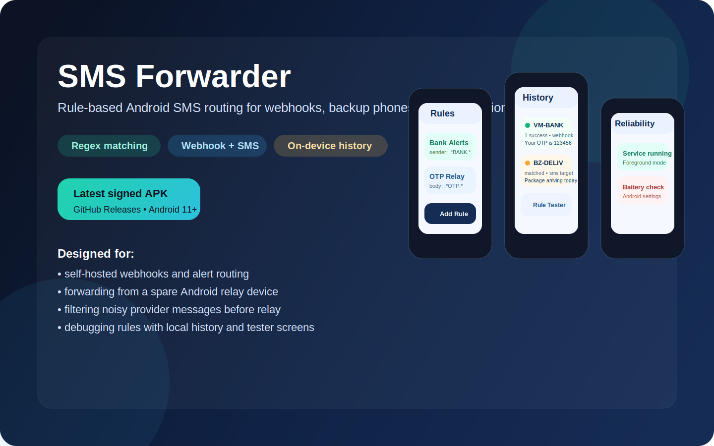

# SMS Forwarder



[](https://github.com/SunilDhaker/SMSForwarder/releases/latest)
[](https://github.com/SunilDhaker/SMSForwarder/actions/workflows/android-ci.yml)
[](LICENSE)

Android app for forwarding incoming SMS messages to a webhook or another phone number using sender and body matching rules.

Built for people who want a lightweight Android relay for OTPs, service alerts, backup phones, self-hosted flows, or simple automation.

## Install

Download the latest signed APK from the [latest release](https://github.com/SunilDhaker/SMSForwarder/releases/latest).

## Why This Repo Exists

- Route important SMS messages into your own systems without a cloud dependency.
- Filter aggressively with regex before anything gets forwarded.
- Rewrite message content before sending it onward.
- Keep a local forwarding history so rules are debuggable.

## Preview

The app ships with three main workflows:

- `Rules`: create sender and body matchers, rewrite content, and choose SMS or webhook targets.
- `History`: inspect matched messages and forwarding outcomes.
- `Reliability`: control the foreground service and Android background settings.

## Core Features

- Regex-based sender and body matching
- Optional text replacement before forwarding
- SMS and webhook targets
- Forward history and logs
- Built-in regex tester
- Foreground service controls for Android reliability

## Quick Start

1. Install the latest APK from [Releases](https://github.com/SunilDhaker/SMSForwarder/releases/latest).
2. Grant SMS, notification, and network permissions.
3. Create a rule from the `Rules` tab.
4. Test matching from the `Tester` tab.
5. Keep the foreground service enabled if you need consistent delivery.

## Use Cases

- Forward bank or service alerts to a private webhook
- Mirror messages from a secondary SIM to a primary device
- Filter provider messages before relaying them
- Build simple SMS-triggered automations without a paid gateway

## Documentation

- [Usage Guide](docs/USAGE.md)
- [Contributing](CONTRIBUTING.md)
- [Security Policy](SECURITY.md)
- [Support](SUPPORT.md)
- [Code of Conduct](CODE_OF_CONDUCT.md)

## Release Signing

1. Generate a keystore once:

```bash
keytool -genkeypair -v -keystore release.keystore -alias smsforwarder -keyalg RSA -keysize 2048 -validity 10000
```

2. Create local signing config:

```bash
cp keystore.properties.example keystore.properties
```

3. Build a signed APK:

```bash
./gradlew assembleRelease
```

The release signing config is read from `keystore.properties` or these CI variables:

- `ANDROID_SIGNING_STORE_FILE`
- `ANDROID_SIGNING_STORE_PASSWORD`
- `ANDROID_SIGNING_KEY_ALIAS`
- `ANDROID_SIGNING_KEY_PASSWORD`

## Permissions

- `RECEIVE_SMS`: receive incoming messages
- `SEND_SMS`: forward to another phone number
- `INTERNET`: forward to webhooks
- `RECEIVE_BOOT_COMPLETED`: restore background service after reboot
- `POST_NOTIFICATIONS`: show delivery and service status

## Security Notes

- Do not commit real phone numbers, webhook URLs, or secret tokens.
- Forwarded SMS content may contain sensitive data.
- Use the signed release APK from the release page for installation.

## License

MIT. See [LICENSE](LICENSE).
